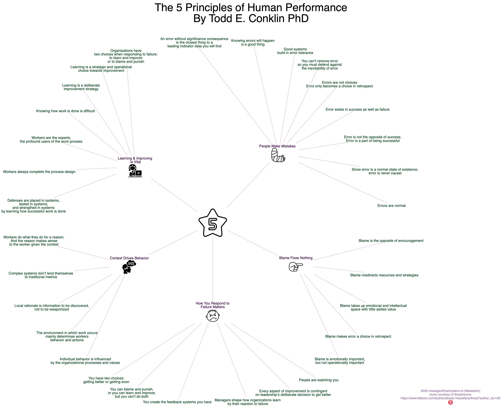

Hopefully helpful HOP visualization distilled from Todd Conklin&#39;s <a href="https://www.amazon.com/Principles-Human-Performance-Contemporary-Updateof/dp/B07PWYCZLS" target="_blank" rel="nofollow noopener noreferrer" translate="no">https://www.amazon.com/Principles-Human-Performance-Contemporary-Updateof/dp/B07PWYCZLS</a> that I had only posted to the Other Site.

###### [Mastodon Source 🐘](https://hachyderm.io/@mweagle/111656836524243682)

___

Posted to <a href="https://mweagle.io/posts/principlesofhop/" target="_blank" rel="nofollow noopener noreferrer" translate="no">https://mweagle.io/posts/principlesofhop/</a> with PDF and SVG versions. I&#39;m not sure what the issue is with the SVG output not including referenced PNGs.

###### [Mastodon Source 🐘](https://hachyderm.io/@mweagle/111693688714447474)

___
