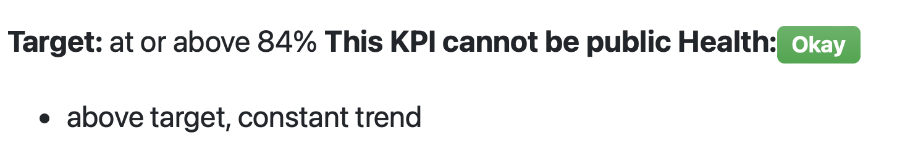

Anyone I know have contacts at GitLab? This seems like an inadvertent disclosure:

<a href="https://handbook.gitlab.com/handbook/engineering/performance-indicators/#key-performance-indicators" target="_blank" rel="nofollow noopener noreferrer" translate="no">https://handbook.gitlab.com/handbook/engineering/performance-indicators/#key-performance-indicators</a>

###### [Mastodon Source 🐘](https://hachyderm.io/@mweagle/111797597143551916)

___
