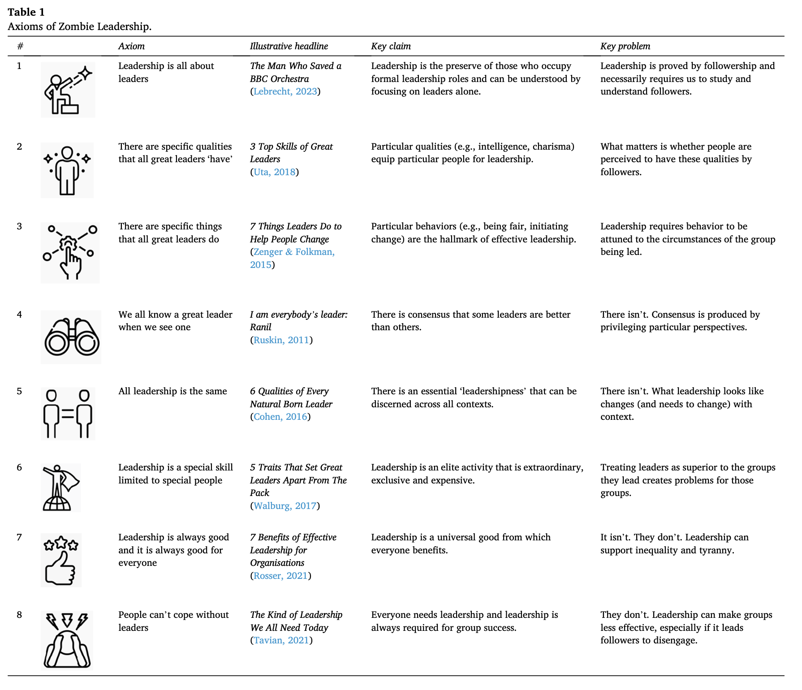

🧟‍♂️ leadership 

“As with economics, the ideas about leadership that prove particularly hard to kill are those that simplify a knotty social process while at the same time legitimizing the privileges of social elites and the leadership industrial complex that supports them — a complex of self-aggrandizing personal coaching, expensive development programs, and glossy business magazines.”

<a href="https://www.sciencedirect.com/science/article/pii/S1048984323000966?via%3Dihub" target="_blank" rel="nofollow noopener noreferrer" translate="no">https://www.sciencedirect.com/science/article/pii/S1048984323000966?via%3Dihub</a>

###### [Mastodon Source 🐘](https://hachyderm.io/@mweagle/111840682000423724)

___

Axioms of Zombie leadership cheat sheet

###### [Mastodon Source 🐘](https://hachyderm.io/@mweagle/111840689936531354)

___
