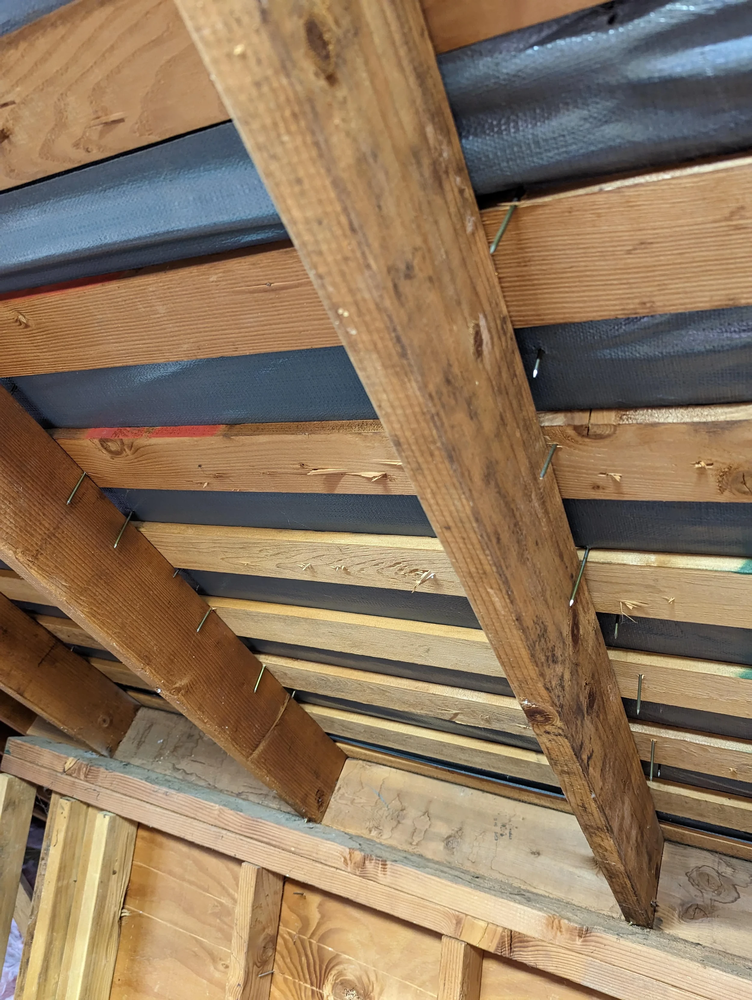

Roofing with a power nailer makes this type of issue more likely. Feedback is both quicker and less frequent vs. driving a nail with a hammer. It&#39;s *very* obvious using hand tools when I miss sinking the nail into the rafter.

But the owner can&#39;t see the difference from the outside. It’s “done” and the worker using the power nailer probably was “more productive&quot; installing the roof than me with a hammer. 

However, there are windstorms in the forecast. 

Related: <a href="https://visualstudiomagazine.com/Articles/2024/01/25/copilot-research.aspx" target="_blank" rel="nofollow noopener noreferrer" translate="no">https://visualstudiomagazine.com/Articles/2024/01/25/copilot-research.aspx</a>

###### [Mastodon Source 🐘](https://hachyderm.io/@mweagle/111840766357166706)

___
