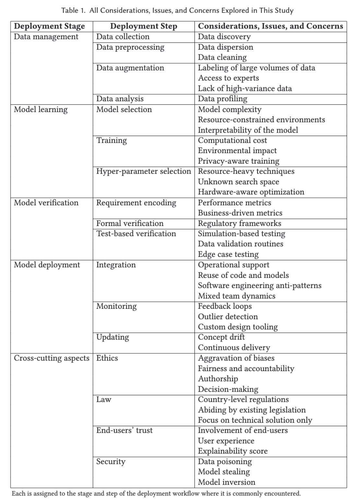

Good survey paper that includes ethical considerations (&quot;neutral&quot; demographic data is biased) and the importance of interpretability for ML deployments. 

&quot;Many pain points we have described in this work were already experienced by communities in these fields, and the ML community should turn to them for solutions and inspiration.”

<a href="https://dl.acm.org/doi/10.1145/3533378" target="_blank" rel="nofollow noopener noreferrer" translate="no">https://dl.acm.org/doi/10.1145/3533378</a>

###### [Mastodon Source 🐘](https://hachyderm.io/@mweagle/111852379487404825)

___

Some of these challenges are shared with normal software engineering practices, but others are unique to ML.

###### [Mastodon Source 🐘](https://hachyderm.io/@mweagle/111852390839136987)

___

This closing observation highlights the distance between theory and practice:

&quot;As an observation that follows from the process of collecting papers to review in this survey, we note the relative shortage of deployment experience reports in the academic literature.”

###### [Mastodon Source 🐘](https://hachyderm.io/@mweagle/111852403428097337)

___
