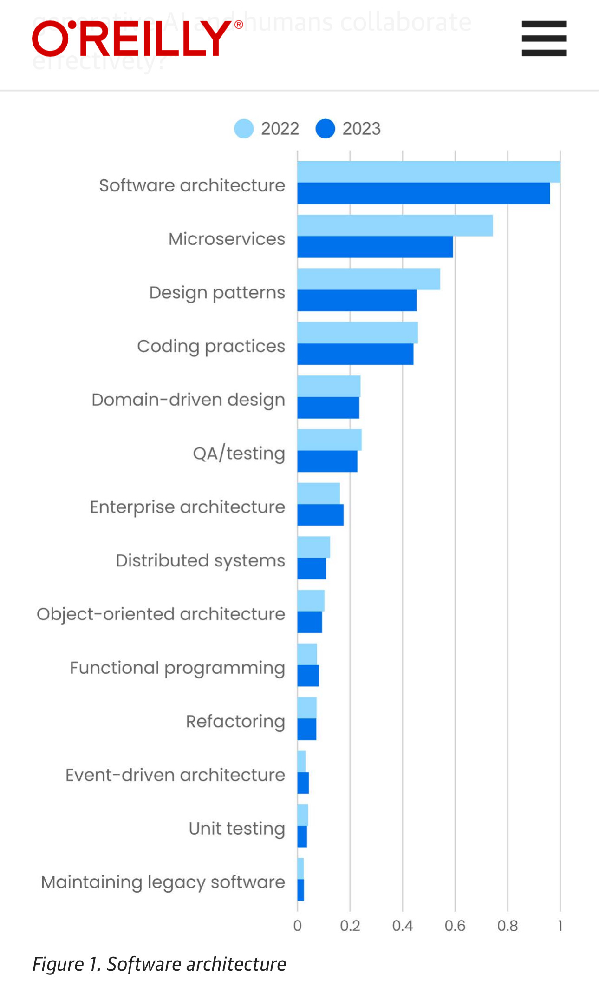

“But to thrive in that new industry, programmers will need to know more about architecture, more about design, more about human relations—and we’re only starting to see that in our data, primarily for topics like product management and communications skills. And perhaps that’s the definition of “disruptive”: when our systems and our expectations change faster than our ability to keep up.”

<a href="https://www.oreilly.com/radar/technology-trends-for-2024/" target="_blank" rel="nofollow noopener noreferrer" translate="no">https://www.oreilly.com/radar/technology-trends-for-2024/</a>

###### [Mastodon Source 🐘](https://hachyderm.io/@mweagle/111860128005683093)

___

“It’s possible that understanding patterns seems less important when AI is writing a lot of the code for you. It’s also possible that design patterns seem less relevant when code is already largely written; most programmers maintain existing applications rather than develop new greenfield apps, and few texts about design patterns discuss the patterns that are embedded in legacy applications.”

Also:

###### [Mastodon Source 🐘](https://hachyderm.io/@mweagle/111860148917183638)

___
