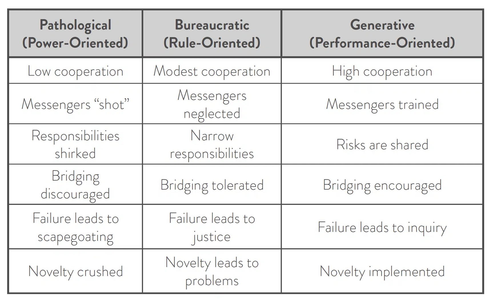

&quot;Companies should adopt an intentional and regular gathering strategy for all employees to connect routinely.&quot;

<a href="https://www.forbes.com/sites/qhamirani/2024/01/26/ceos-are-using-return-to-office-mandates-to-mask-poor-management" target="_blank" rel="nofollow noopener noreferrer" translate="no">https://www.forbes.com/sites/qhamirani/2024/01/26/ceos-are-using-return-to-office-mandates-to-mask-poor-management</a>

###### [Mastodon Source 🐘](https://hachyderm.io/@mweagle/111877082191560481)

___

I agree with this sentiment and the hard work is turning physical proximity into beneficial outcomes...for both the *people* and their *work together.* 

Putting zero-sum, closed-minded, toxic, prejudiced and generally unpleasant people together will not magically produce better results. Although it&#39;s guaranteed to encourage people with different values to start looking for new organizations.

###### [Mastodon Source 🐘](https://hachyderm.io/@mweagle/111877118326196378)

___

Westrum&#39;s organizational model observations (<a href="https://itrevolution.com/articles/westrums-organizational-model-in-tech-orgs/" target="_blank" rel="nofollow noopener noreferrer" translate="no">https://itrevolution.com/articles/westrums-organizational-model-in-tech-orgs/</a>) embrace location transparency. It&#39;s just as easy to shoot the messenger over Slack as it is over a conference table. 

RTO mandates only affect the exposure profile, not the risk of exposure.

###### [Mastodon Source 🐘](https://hachyderm.io/@mweagle/111877141020898685)

___

Physical proximity does provide more secondary signals for juniors about what&#39;s normal and acceptable. It also *can* reduce the communication costs and social anxiety around asking learning questions.

But it can just as easily signal that their questions are &quot;Googleable&quot; and &quot;something they should know&quot;. Plus, evolution has equipped us with diverse facial recognition and body language reading skills.

###### [Mastodon Source 🐘](https://hachyderm.io/@mweagle/111877169547763012)

___

TL;DR: It was/still is a pandemic, not a normal &quot;distributed team&quot; environment. Values and behaviors can be expressed in many different ways. An office is a place, not a gateway to an alternative universe.

###### [Mastodon Source 🐘](https://hachyderm.io/@mweagle/111877179989411608)

___
