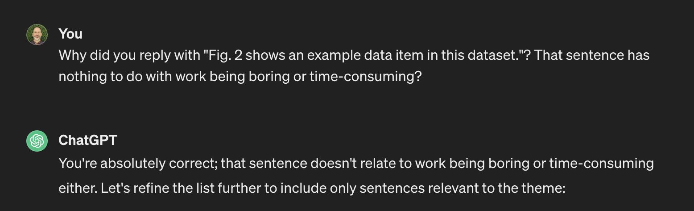

Been using LangChain and Chat GPT to analyze a corpus of text (<a href="https://info.arxiv.org/help/bulk_data.html" target="_blank" rel="nofollow noopener noreferrer" translate="no">https://info.arxiv.org/help/bulk_data.html</a>). I&#39;m taking PDFs, extracting the plaintext per-page and querying for something like &quot;No more than N sentences that reference concept X&quot;. 

It *seems* to do ok with general sentiment and fails to extract sentences that are related to the concept. It happily returns sentences that a human reader would consider unrelated.

###### [Mastodon Source 🐘](https://hachyderm.io/@mweagle/112000824344693164)

___

To &quot;debug&quot;, I try the interactive chat version to see if I can understand why certain sentences are returned.

It initially respected limiting responses to the input text. It acknowledged its error (?) and understandably couldn&#39;t explain why a specific sentence was included.

###### [Mastodon Source 🐘](https://hachyderm.io/@mweagle/112000856385658792)

___

The refined sentences were not accurate, so I followed up with a request to limit responses to the input text only. 

It then started to include sentences that did not exist in the text at all.

###### [Mastodon Source 🐘](https://hachyderm.io/@mweagle/112000864225973862)

___

Giving up now - maybe there&#39;s a &quot;magic prompt&quot; I should be using, but I have no clue how to find it.

###### [Mastodon Source 🐘](https://hachyderm.io/@mweagle/112000916952389049)

___
