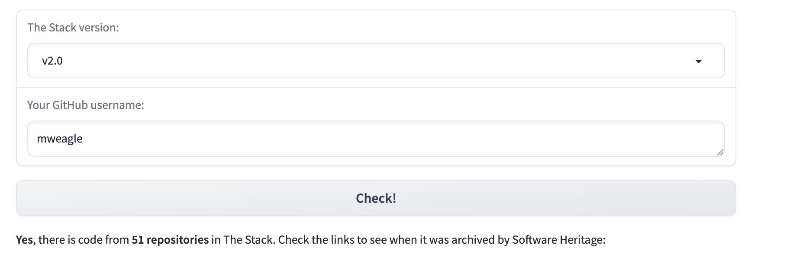

This is disappointing. 

The goal to “give people agency over their source code” could be more directly be done by “first asking people to opt-in for code mining”.

###### [Mastodon Source 🐘](https://hachyderm.io/@mweagle/112131109723481399)

___
