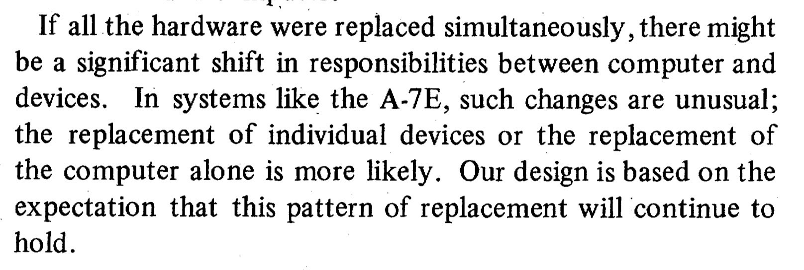

“When we examined actual software projects and their documentation, few showed any use of the ideas and no successful product appeared to have been designed by consistent application of the principles touted at conferences and in journals. The ideas appeared to be easier to write about than to use.”

<a href="https://www.researchgate.net/publication/2814490_The_Modular_Structure_of_Complex_Systems" target="_blank" rel="nofollow noopener noreferrer" translate="no">https://www.researchgate.net/publication/2814490_The_Modular_Structure_of_Complex_Systems</a>

###### [Mastodon Source 🐘](https://hachyderm.io/@mweagle/112390374189452620)

___

Evergreen wisdom from 1985: design boundaries based on different expected rates of change. And if everything changes concurrently, an asteroid may have radically changed the entire environment.

###### [Mastodon Source 🐘](https://hachyderm.io/@mweagle/112390392586997209)

___
