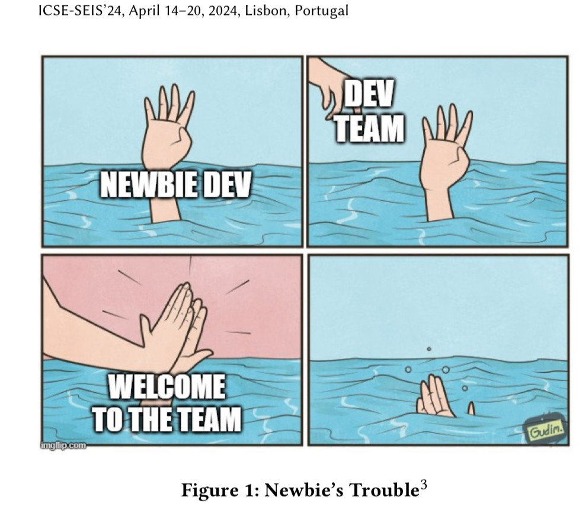

“The top areas of improvement recommended by new engineers were training and work distribution and planning methods.”

<a href="https://rdel.substack.com/p/rdel-41-what-causes-new-engineers" target="_blank" rel="nofollow noopener noreferrer" translate="no">https://rdel.substack.com/p/rdel-41-what-causes-new-engineers</a>

###### [Mastodon Source 🐘](https://hachyderm.io/@mweagle/112477290432381327)

___

Research paper includes memes 😀

###### [Mastodon Source 🐘](https://hachyderm.io/@mweagle/112477302323676154)

___
