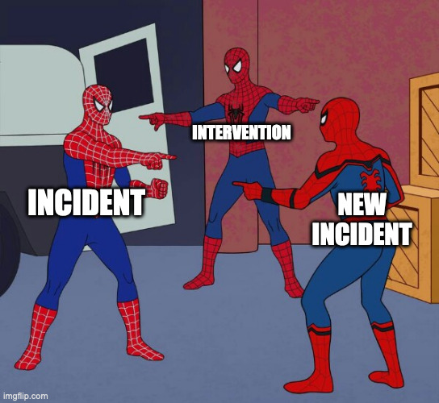

Medicine has the idea of &quot;iatrogenic impacts”: illness induced by intervention intended to address a known problem.  

This seems like something that may already or should exist in engineering? Work done to address “service illness&quot; may mitigate known undesirable outcomes at the expense of creating new ones.

<a href="https://doublepulsar.com/microsoft-need-to-be-transparent-about-customer-impacting-ddos-attacks-763a9c0d46ef" target="_blank" rel="nofollow noopener noreferrer" translate="no">https://doublepulsar.com/microsoft-need-to-be-transparent-about-customer-impacting-ddos-attacks-763a9c0d46ef</a>

###### [Mastodon Source 🐘](https://hachyderm.io/@mweagle/112882152714044184)

___

We are all SpiderMan

###### [Mastodon Source 🐘](https://hachyderm.io/@mweagle/112882243339605125)

___
