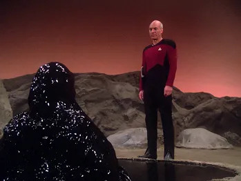

I’m resealing a water feature with non-toxic epoxy that’s animal safe. The instructions repeatedly state to cover to a 10mils thickness (about 3 sheets of paper). 

I have no idea how to measure that.

###### [Mastodon Source 🐘](https://hachyderm.io/@mweagle/112905082029138129)

___

Battling this product

###### [Mastodon Source 🐘](https://hachyderm.io/@mweagle/112905108834985740)

___

Moment of truth…well, more like 45 moments until it&#39;s full and I see if the coating worked.

###### [Mastodon Source 🐘](https://hachyderm.io/@mweagle/112923160782241828)

___
