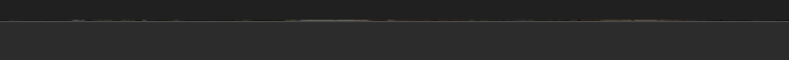

I don&#39;t know if this is new behavior with Sequoia...I&#39;ve noticed that when I maximize windows now they are no longer flush with the menu bar. There is a gap through which the background renders, so it looks like there&#39;s a tear in the screen. Not distracting at all.

###### [Mastodon Source 🐘](https://hachyderm.io/@mweagle/113233568301655276)

___
