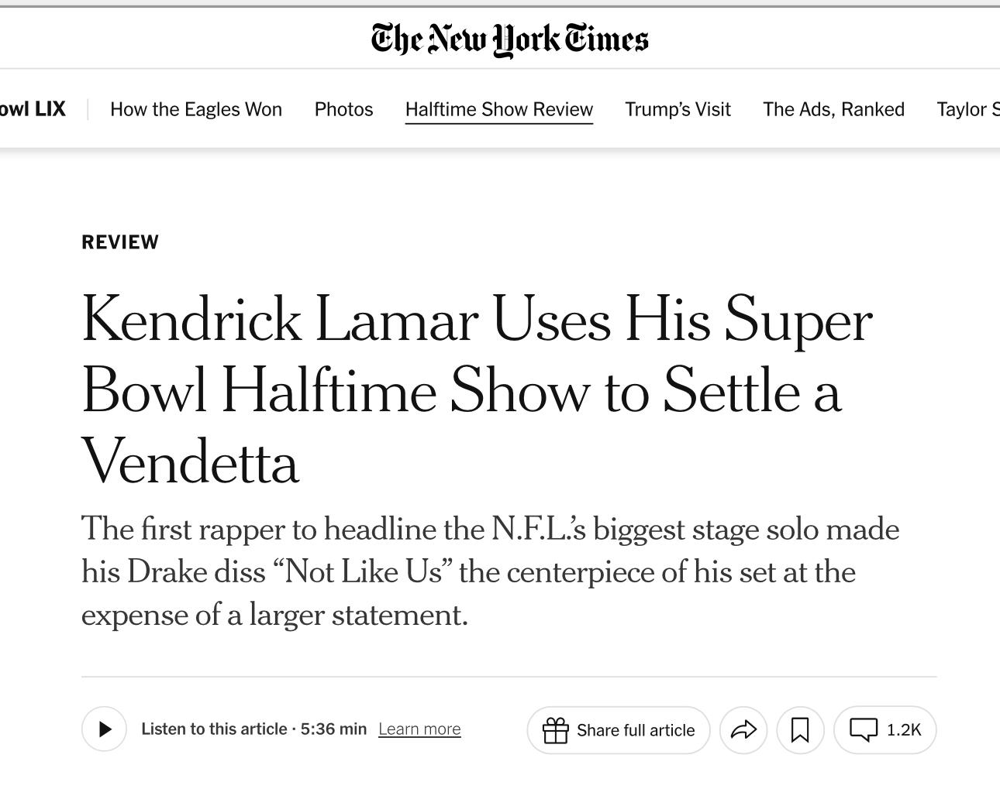

I skipped the game and have watched this three times 

<a href="https://www.si.com/nfl/kendrick-lamar-performance-super-bowl-lix-most-watched-halftime-show" target="_blank" rel="nofollow noopener noreferrer" translate="no">https://www.si.com/nfl/kendrick-lamar-performance-super-bowl-lix-most-watched-halftime-show</a>

###### [Mastodon Source 🐘](https://hachyderm.io/@mweagle/113988816321893776)

___

The NYT is culturally lost.

###### [Mastodon Source 🐘](https://hachyderm.io/@mweagle/113988840101220080)

___

I keep thinking about this and how the the headline is exactly what he&#39;s railing against…Kendrick literally said: &quot;40 acres and a mule, this is bigger than the music. They tried to rig the game, but you can’t fake influence&quot; 

That isn&#39;t about Drake. It&#39;s about America.

###### [Mastodon Source 🐘](https://hachyderm.io/@mweagle/113989604784429432)

___
