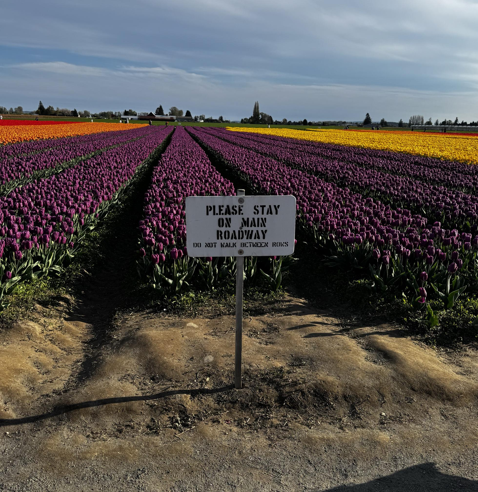

Drove up to see the Tulip Festival (<a href="https://tulipfestival.org" target="_blank" rel="nofollow noopener noreferrer" translate="no">https://tulipfestival.org</a>). Recommended 🌷!

As you might imagine, policy enforcement was difficult and understaffed.  There were &quot;flower watchers” who patrolled the area, but the size of the area to cover, the number of people, and the exhaustion of repeating the same message thousands of times a day made that really tough. 

Related: “I told everyone to not submit insecure code&quot; does not produce secure code.

###### [Mastodon Source 🐘](https://hachyderm.io/@mweagle/114348651395891565)

___

Excellent plantings and long stretches of color.

###### [Mastodon Source 🐘](https://hachyderm.io/@mweagle/114348672593005740)

___
