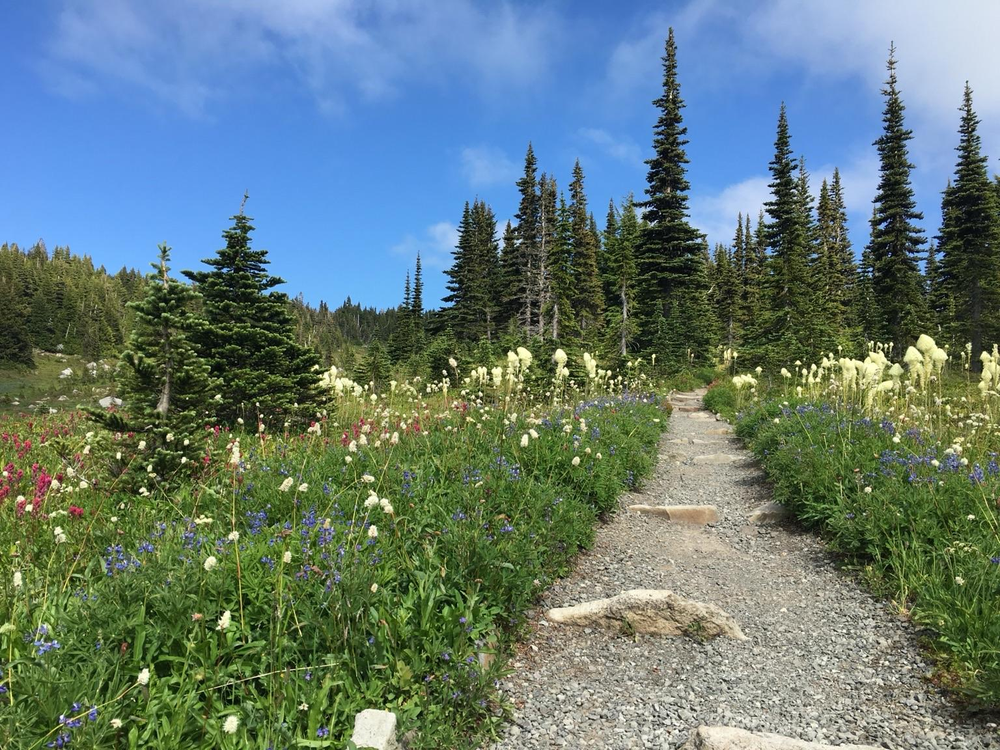
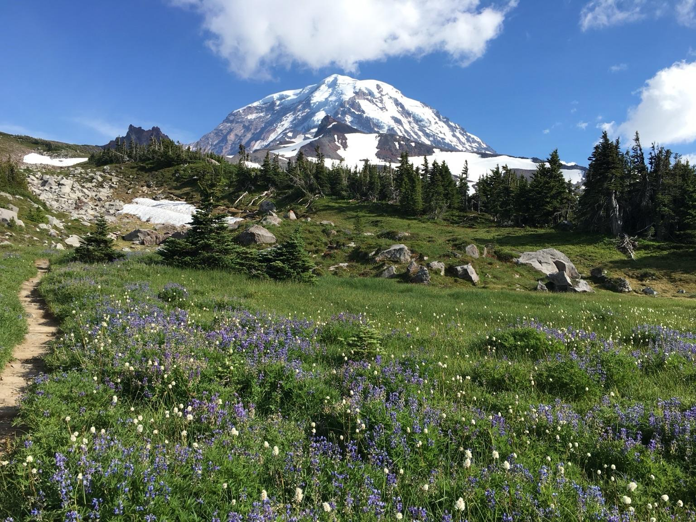

The bridge had a good run and has served decades longer than intended. The Spray Park trailhead leaves from Mowich Lake and is one of the best trails in the park. (Shot from years ago). 

<a href="https://wsdot.wa.gov/about/news/2025/sr-165-carbon-river-fairfax-bridge-closed-until-further-notice" target="_blank" rel="nofollow noopener noreferrer" translate="no">https://wsdot.wa.gov/about/news/2025/sr-165-carbon-river-fairfax-bridge-closed-until-further-notice</a>

###### [Mastodon Source 🐘](https://hachyderm.io/@mweagle/114393308562323162)

___
