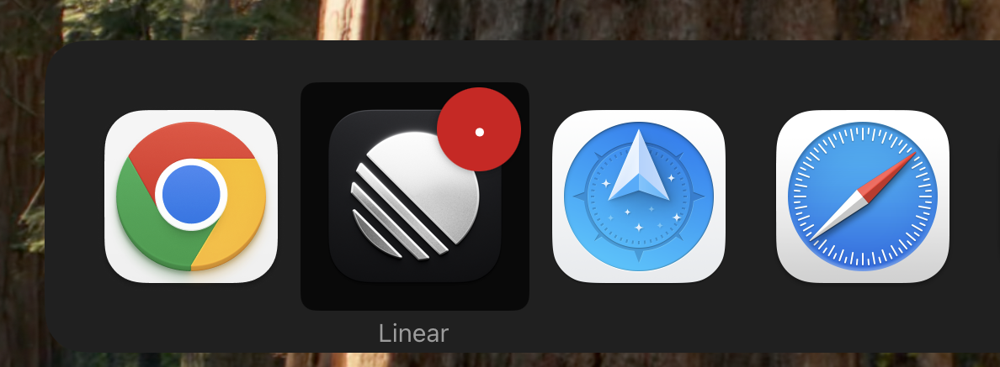

I could really use some icon diversity. Trying to switch apps I&#39;m regularly jolted out of automatic mode trying to distinguish these icons.

###### [Mastodon Source 🐘](https://hachyderm.io/@mweagle/114693919639604099)

___
