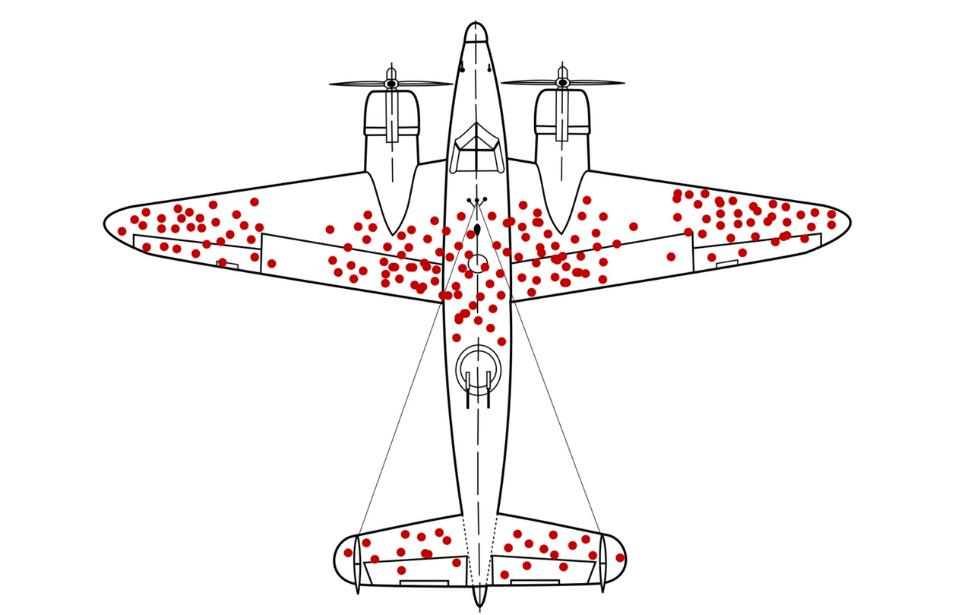

Requiring relocation with the knowledge that management expects AI to cause further RIFs. 

&quot;The company spokesperson said “we hear from the majority of our teammates that they love the energy from being located together,...&quot;

<a href="https://www.seattletimes.com/business/amazon-orders-employees-to-relocate-to-seattle-and-other-hubs/" target="_blank" rel="nofollow noopener noreferrer" translate="no">https://www.seattletimes.com/business/amazon-orders-employees-to-relocate-to-seattle-and-other-hubs/</a>

###### [Mastodon Source 🐘](https://hachyderm.io/@mweagle/114707709774161714)

___
