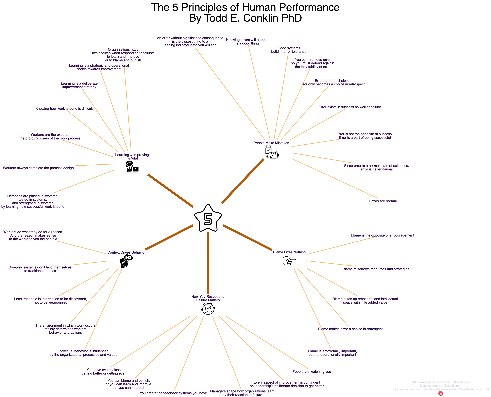

## Five Principles Visualization

Todd Conklin is the host of the recommended [PreAccident Investigation Podcast](https://preaccidentpodcast.podbean.com) and recently published a book titled [The 5 Principles of Human Performance](https://a.co/d/b6VGAc9). It's an excellent introduction to high-performing organizations and the New View of Safety. To learn more, please visit Lorin Hochstein's Github repo of [resiliency papers](https://github.com/lorin/resilience-engineering).

In the meantime, I've distilled Todd's Five Principles into a single visualization below:

I've also created [PDF](./principles.dot.pdf) and [SVG](./principles.dot.svg) versions. The SVG version doesn't include the dotfile PNG references. I'm not sure what the issue is there.

## Raw Text

The full raw text of the visualization is posted below. Thanks to [Geoff Baskwill](https://mastodon.cloud/@geoff_baskwill#.) for the recommendation!

* *Five Principles of Human Performance*
  * **People Make Mistakes**
    * Errors are normal
    * Since error is a normal state of existence, error is never causal
    * Error is not the opposite of success. Error is a part of being successful
    * Error exists in success as well as failure
    * Errors are not choices. Error only becomes a choice in retrospect
    * You can't remove error so you must defend against the inevitability of error
    * Good systems build in error tolerance
    * Knowing errors will happen is a good thing
    * An error without significance consequence is the closest thing to a leading indicator data you will find
  * **Learning And Improving**
    * Organizations have two choices when responding to failure: to learn and improve or to blame and punish
    * Learning is a strategic and operational choice towards improvement
    * Learning is a deliberate improvement strategy
    * Knowing how work is done is difficult
    * Workers are the experts, the profound users of the work process
    * Workers always complete the process design
    * Defenses are placed in systems, tested in systems, and strengthed in systems by learning how successful work is done
  * **Context Drives Behavior**
    * Workers do what they do for a reason. And the reason makes sense to the worker given the context
    * Complex systems don't lend themselves to traditional metrics
    * Local rationale is information to be discovered, not to be weaponized
    * The environment in which work occurs mainly determines workers behavior and actions
    * Individual behavior is influenced by the organizational processes and values
  * **How You Respond to Failure Matters**
    * You have two choices: getting better or getting even
    * You can blame and punish, or you can learn and improve, but you can't do both
    * You create the feedback systems you have
    * Managers shape how organizations learn by their reaction to failure
    * Every aspect of improvement is contingent on leadership's deliberate decision to get better
    * People are watching you
  * **Blame Fixes Nothing**
    * Blame is emotionally important, but not operationally important
    * Blame makes error a choice in retrospect
    * Blame takes up emotional and intellectual space with little added value
    * Blame misdirects resources and strategies
    * Blame is the opposite of encouragement

## References

## Attributions

Photo by [Nick Fewings](https://unsplash.com/photos/scrabbled-scrabble-tiles-with-words-on-them-EkyuhD7uwSM?utm_content=creditShareLink&utm_medium=referral&utm_source=unsplash) on _Unsplash_.
  