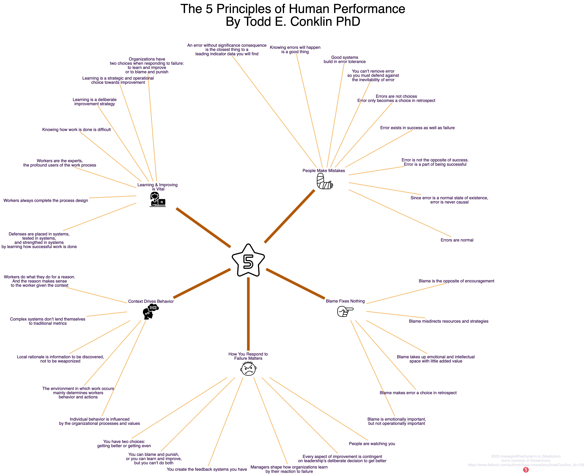

Todd Conklin is the host of the recommended [PreAccident Investigation Podcast](https://preaccidentpodcast.podbean.com) and recently published a book titled [The 5 Principles of Human Performance](https://a.co/d/b6VGAc9). It's an excellent introduction to high-performing organizations and the New View of Safety. To learn more, please visit [Lorin Hochstein's] Github repo of [resiliency papers](https://github.com/lorin/resilience-engineering). 

In the meantime, I've distilled Todd's Five Principles into a single visualization below:

I've also created [PDF](./principles.dot.pdf) and [SVG](./principles.dot.svg) versions. The SVG version doesn't include the dotfile PNG references. I'm not sure what the issue is there.

### Attributions

Photo by [Nick Fewings](https://unsplash.com/photos/scrabbled-scrabble-tiles-with-words-on-them-EkyuhD7uwSM?utm_content=creditShareLink&utm_medium=referral&utm_source=unsplash) on _Unsplash_.
  